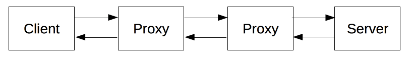

# IP

> 인터넷에 연결되어 있는 모든 장치들을 식별할 수 있도록 각각의 장비에게 부여되는 고유 주소

* IPv4 | IPv6 두 가지가 있다

## 고정 | 유동 IP

* 고정 IP : 변하지 않고 컴퓨터에 고정적으로 부여된 IP
* 유동 IP : 변하는 IP - 인터넷 사용자 모두에게 고정 IP를 부여할 수 없기 때문에 인터넷에 접속하는 매 순간마다 임의로 발급해준다
    * 대부분의 사용자는 유동 IP를 사용한다

## 공인 | 사성 IP

> IP 주소는 임의로 우리가 부여하는 것이 아니라 전 세계적으로 ICANN 이라는 기관이
> 국가별로 사용할 대역을 관리하고, 우리나라는 KISA 에서 국내 IP 주소를 관리한다

* 공인 IP : ISP(통신업체)가 IP를 부여 받고 우리가 기업을 통해 IP를 제공받는 것
* 사설 IP : 어떤 네트워크 안에서 내부적으로 사용되는 고유한 주소

  공인 IP는 전세계에서 유일하지만, 사설 IP는 네트워크 안에서 유일하다

# TCP, Transmission Control Protocol

* 서버와 클라이언트 간에 데이터를 신뢰성 있게 전달하기 위해 만들어진 프로토콜
* 데이터를 전송하기 전에 데이터 전송을 위한 연결을 만드는 연결 지향 프로토콜

## 특징

* 신뢰성 : 송상되거나 없어지거나 중복되거나 네트워크 계층에서 순서가 잘못된 데이터를 복구해야 한다
* 흐름 제어 : 컴퓨터는 CPU와 네트워크 대역폭의 차이 때문에 서로 다른 데이터 속도로 작동할 수 있다. 이를 해결하기 위해 구현한다
* 다중화 : 한 라우터의 많은 프로세스가 TCP 통신 서비스를 동시에 사용할 수 있다
    * TCP를 사용하는 응용프로그램에 포트 번호 값을 연계시킨다
* 연결형 서비스 : 응용 프로그램 ㅍ로세스는 TCP를 사용하여 데이터를 보낼 수 있는 상태가 되려면 먼저 연결을 설정해야 한다
* 양방향 전송 :TCP 연결은 데이터를 양방향 전송 가능
* 3way handshake
  

# UDP, User Datagram Protocol

* 비연결형, 신뢰성이 없는 전송 프로토콜
* UDP는 TCP/IP 5계층에서의 프로토콜이다
* IP 데이터그램을 캡슐화하여 보내는 방법과 연결 설정을 하지 않고 보내는 방법을 제공한다

## 특징

* 신뢰성이 없다 : 전송 중 내용이 손실될 수 있다, 세그먼트의 수서가 바뀔 수 있다
* TCP 보다 간단하고 빠르다
* header 의 크기가 작다
* 전송 속도가 빠르다 : 흐름 제어를 하지 않기 때문
* 비연결성 : 수신자와 송신자 간의 handshaking 이 없다

## 사용하는 이유

* 신뢰성보다 속도가 중요한 부분에서 사용한다

# HTTP

* HTML 문서와 같은 리소스들을 가져올 수 있도록 해주는 프로토콜
* 클라이언트-서버 프로토콜 : 수신자 측에 의해 요청이 초기화되는 프로토콜을 의미한다4

클라이언트와 서버들은 개별적인 메시지 교환에 의해 통신한다

* 요청 : 클라이언트에 의해 전송되는 메시지
* 응답 : 서버가 클라이언트의 메시지에 응답으로 전송되는 메시지

* 프록시 : 다양한 작업을 수행하는 데이트웨이 또는 캐시의 역할을 한다

## 특징

* 간단하다 : 사람이 읽기 쉽게 고안되었다
* 확장 가능하다 : 클라이언트와 서버가 새로운 헤더의 시멘틱에 대해 간단한 합의만 한다면, 언젣ㄴ지 새로운 기능을 추가할 수 있다
* 상태는 없지만 세션은 있다 : HTTP는 무상태(Stateless)이다. 동일한 연결 상에서 연속하여 전달된 두 개의 요청 사이에 연결고리가 없다
* 연결 : 전송 계층에서 제어되므로 근본적으로 HTTP 영역 밖이다. 연결이 필수는 아니지만 TCP 표준에 의존한다
* 제어할 수 있는 것 : 캐시 혹은 인증 메소드, 제약 사항 완화
* 흐름 :
    * 서버에 대한 여러 TCP 연결 가능
    * HTTP 메소드 전송
    * 전송된 응답을 읽는다
    * 연결을 닫거나 다른 요청들을 위해 재사용 한다
* 메시지 : 요청과 응답으로 각자의 특성이 있는 형식을 가지고 있다

## 결론

* HTTP 는 사용이 쉬운 확장 가능한 프로토콜이다
