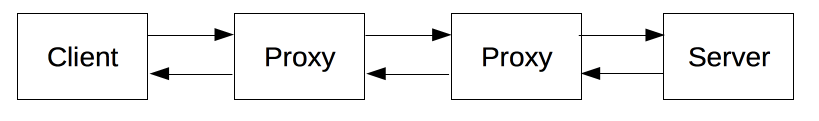

# HTTP

> HTML 문서 같은 리소스들을 가져올 수 있도록 해주는 프로토콜

* 웹에서 이루어지는 모든 데이터 교환의 기초
* `클라이언트-서버 프로토콜` : 수신자 측에 요청이 초기화되는 프로토콜

## 동작 방법

> 개별적인 메시지 교환에 의해 통신한다

* `요청` : 클라이언트에 의해 전송되는 메시지
* `응답` : 요청에 대한 응답으로 전송되는 메시지

  HTTP는 필요할 때마다 웹 페이지를 갱신하기 위해 문서의 일부를 가져오는데 사용될 수도 있다

## 구성 요소

* 요청은 개체, 사용자 에이전트, 프록시에 의해 전송된다.
* 각각의 요청들은 서버로 보내지며 서버는 응답을 제공한다. 이때 여러 개의 개체들이 있다
* `프록시` : 게이트웨이 또는 캐시의 역할을 한다
* `캐시` : HTTP 응답들을 일시적으로 저장하는 곳

* 이들은 네트워크와 전송 계층 내로 숨겨진다.
* HTTP는 애플리케이션 계층의 최상위에 있다.

### 클라이언트 : 사용자 에이전트

> 사용자를 대신하여 동작하는 모든 도구

주로 브라우저에 의해 수행된다.

* 브라우저는 항상 요청을 보내는 개체이다. 절대 서버가 될 수 없다
* 브라우저는 응답을 받아 HTML 문서를 받으면 그것을 화면에 출력하며, 이때 많은 도구들이 사용된다

### 웹 서버

> 통신 채널의 반대편에는 클라이언트에 의한 요청에 대한 문서를 제공하는 서버가 존재한다

* 서버는 논리적 단일 기계이다. 이는 정보를 얻고 완전하게 혹은 부분적으로 문서를 생성하는 소프트웨어의 복잡한 부분을 공유하는 서버들의 집합일 수도 있기 때문이다.
* 서버는 반드시 단일 기계일 필요는 없지만, 여러 개의 서버를 동일한 기계 위에서 호스팅할 수는 있다
* Host 헤더를 이용하여, 동일한 IP 주소를 공유할 수도 있다

### 프록시

> 컴퓨터와 머신 중에서 애플리케이션 계층에서 동작하는 것들을 말한다

* 전송은 보통 전송 | 네트워크 | 물리 계층에서 동작하며 성능에 큰 영향을 주지만, HTTP에서는 이들이 어떻게 동작하는지 보이지 않는다
* 프록시는 눈에 보이거나 그렇지 않을 수 있으며 다양한 기능을 수행할 수 있다

#### 예시

* 캐싱
* 필터링
* 로드밸런싱
* 인증
* 로깅

## HTTP의 특징

* `간단하다` : 사람이 쉽게 읽을 수 있도록 고안되었다
* `확장 가능하다` : HTTP 헤더는 HTTP를 확장하고 실험하기 쉽게 만들어주었다
* `상태는 없지만 세션은 있다` : 무상태를 유지하며 세션과 쿠키를 남겨 상호작용에 문제가 없도록 한다
* `연결` : HTTP는 연결이 필수는 아니지만 연결 기반인 TCP 표준에 의존한다
    * 하지만 TCP가 효율적이지 못할 경우가 있는데 그래서 구글은 UDP를 이용한 전송을 실험한다고 한다
    * 효율적이지 못한 경우 : 요청과 응답에 별도의 TCP를 연결하는 것
* `제어할 수 있는 것` : `캐시` | `origin 제약사항 완화` | `인증` | `프록시와 터널링` | `세션`
* `흐름` : TCP 연결 - HTTP 메시지 전송 - 응답 받기 - 연결 닫기 or 재사용
* `메시지` : 사람이 읽을 수 있는 메시지 형태
