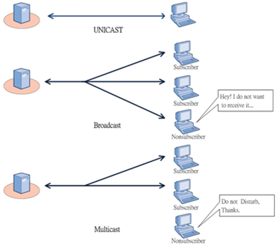

# Unicast

> 정보를 전송하기 위한 프레임에 자신의 MAC 주소와 목적지의 MAC 주소를 첨부하여 전송하는 방식

* MAC 주소가 같지 않은 시스템들도 정보를 수신한다
* 하지만 주소가 같지 않으니 정보를 무시한다
* 만약 주소가 같다면 프레임을 받아서 정보를 처리한다
* 이것은 CPU 성능에 문제를 주지 않는 방식이다

# Broadcast

> 로컬 네트워크에 연결되어 있는 모든 시스템에게 프레임을 보내는 방식

* 브로드캐스트 주소가 미리 정해져있다
* 수신 받는 시스템은 이 주소가 오면 패킷을 자신의 CPU로 전송하고 CPU가 패킷을 처리한다
* 모든 시스템에게 전송되므로 트래픽이 증가하며 CPU도 패킷을 처리해야 하기 때문에 성능에 저하가 생긴다

## 사용하는 경우

* MAC 주소를 모르는 경우
* 네트워크에 있는 모든 시스템에게 알리는 경우
* 라우터끼리 정보를 교환하거나 새로운 라우터를 찾는 경우

# Multicast

> 네트워크에 연결되어 있는 시스템 중 일부에게만 정보를 전송하는 것 = 특정 그룹에 속해 있는 시스템에게만 한 번에 정보를 전송하는 방법

* 단점 : 라우터가 멀티캐스트를 지원해야만 사용 가능하다
* 그룹 통신을 위하여 다중 수신자들에게 동일한 데이터를 전송하고자 할 경우 유니캐스트
* 유니캐스트는 여러 번 전송해서 네트워크 효율을 떨어뜨리는 문제점이 있는데 이를 해결할 수 있다
* 여러 수신자에게 한 번에 메시지가 전송될 수 있기 때문이다. 데이터의 중복 전송을 막을 수 있다

## 특징

* 그룹 단위로 묶어 그 그룹의 Host 들은 동시에 데이터를 받을 수 있다
* UDP 를 사용하여 전송함으로 신뢰성 X
* Client 에서 멀티캐스트를 사용하는 Application 을 시작하면 멀티캐스트 IP 주소와 멀티캐스트 MAC 주소를 라우터에 등록함으로 멀티캐스트 그룹에 등록된다
* 하나의 Client 에서 여러 개의 멀티캐스트 주소를 수용할 수 있다 = 여러 가지 멀티캐스트 데이터를 동시에 받을 수 있다
* Server 가 멀티캐스트 주소로 데이터를 전송 중에 있을 때 중간에 Client 가 끼어들으면 중간부터 데이터를 받게 된다

