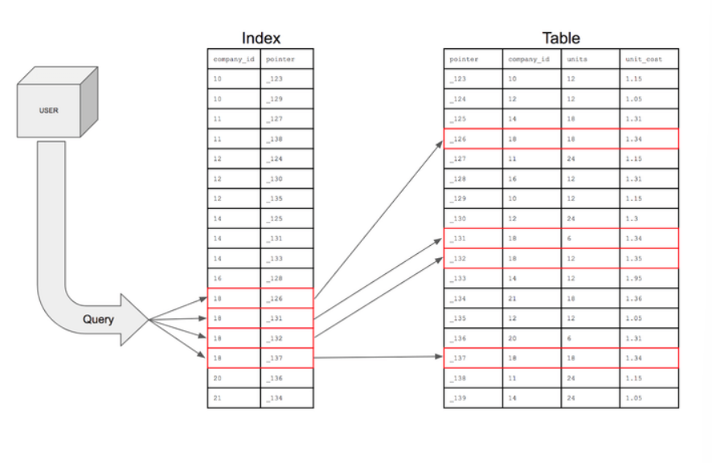

# 데이터베이스 인덱스

> 추가적인 쓰기 작업과 저장 공간을 활용하여 데이터베이스 테이블의 검색 속도를 향상시키기 위한 자료구조

* 책의 색인과 같다
* 데이터의 위치를 포함한 자료구조를 생성하여 빠르게 조회할 수 있도록 돕고 있다

* 인덱스를 활용하면 데이터를 조회하는 `SELECT` 연산 외에도 `UPDATE` 나 `DELETE`의 성능이 함께 향상된다
* 그 이유는 해당 연산을 수행하려면 해당 대상을 조회해야만 작업을 할 수 있기 때문이다

    UPDATE USER SET NAME = "KiHyun" WHERE NAME ="KIM";

* 만약 index를 사용하지 않은 컬럼을 조회해야 하는 상황이라면 전체를 탐색하는 FULL SCAN을 수행해야 한다
* FULL SCAN은 전체를 비교하여 탐색하기 때문에 처리 속도가 떨어진다
## 인덱스의 관리
> DBMS는 index를 항상 최신의 정렬된 상태로 유지해야 원하는 값을 빠르게 탐색할 수 있다.
> 그렇기 때문에 인덱스가 적용된 컬럼에 INSERT, UPDATE, DELETE가 수행된다면 각각 다음과 같은 연산을
> 추가적으로 해주어야 하며 그에 따른 오버헤드가 발생한다
* `INSERT` : 새로운 데이터에 대한 인덱스를 추가함
* `DELETE` : 삭제하는 데이터의 인덱스를 사용하지 않는다는 작업을 진행함
* `UPDATE` : 기존의 인덱스를 사용하지 않음 처리하고, 갱신된 데이터에 대해 인덱스를 추가함

## 인덱스의 장점과 단점
### 장점
* 테이블을 조회하는 속도와 그에 따른 성능을 향상시킬 수 있다
* 전반적인 시스템의 부하를 줄일 수 있다
### 단점
* 인덱스를 관리하기 위해 DB의 약 10%에 해당하는 저장공간이 필요하다
* 인덱스를 관리하기 위해 추가 작업이 필요하다
* 인덱스를 잘못 사용할 경우 오히려 성능이 저하되는 역효과가 발생할 수 있다
- - -
* 만약 위의 세 가지 함수가 빈번하게 사용되는 속성에 인덱스를 걸게 되면 인덱스의 크기가 비대해져서 성능이 저하된다
* 이는 DELETE 와 UPDATE 연산 때문이다
* 이 두 연산은 기존의 인덱스를 삭제하지 않고 '사용하지 않음' 처리를 해준다
* 만약 이 연산이 빈번하게 발생되면 인덱스는 10배로 늘어난다
* 이러면 비대해진 인덱스에 의해 오히려 성능이 떨어진다

## 인덱스를 사용하면 좋은 경우
* 규모가 작지 않은 테이블
* INSERT, UPDATE, DELETE 가 자주 발생하지 않는 컬럼
* JOIN이나 WHERE 또는 ORDER BY에 자주 사용되는 컬럼
* 데이터 중복도가 낮은 컬럼
* 등등

인덱스를 사용하는 것 만큼이나 생성된 인덱스를 관리해주는 것도 중요하다. 그러므로 사용되지 않는 인덱스는 바로 제거해주어야 한다
## 인덱스의 자료구조
### 해시 테이블, Hash Table
> Key-Value로 데이터를 저장하는 자료구조, 빠른 데이터 검색이 필요할 때 유용하다.
> 해시 테이블은 Key값을 이용해 고유한 index를 생성하여 그 index에 저장된 값을 꺼내오는 구조이다
* 값을 꺼내오는데 hash 함수가 필요하다
* 매우 빠른 검색을 지원한다
* 하지만 부등호 연산이 자주 사용되는 데이터베이스 검색에는 적합하지 않다

### B+ Tree
> DB의 인덱스를 위해 자식 노드가 2개 이상인 B- Tree를 개선시킨 자료구조이다.
> B+ Tree는 모든 노드에 데이터(Value)를 저장했던 BTree와 다른 특성을 가진다
* 리프노트(데이터노드)만 인덱스와 함께 데이터(Value)를 가지고 있고, 나머지 노드(인덱스 노드)들은 데이터를 위한 인덱스(Key)만을 갖는다
* 리프노드들은 LinkedList로 연결되어있다
* 데이터 노드 크기는 인덱스 노드의 크기와 같지 않아도 된다

데이터베이스의 인덱스 컬럼은 부등호를 이용한 순차 검색 연산이 자주 발생할 수 있다. 이러한
이유로 BTree의 리프노드들은 LinkedList로 연결하여 순차검색을 용이하게 하는 등 BTree를 인덱스에 맞게 최적화한다
* 해시테이블보다는 느리지만 인덱싱에 더 적합한 자료구조이다
