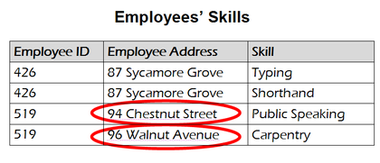
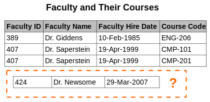

# 정규화

> 관계형 데이터베이스의 설계에서 중복을 최소화하게 데이터를 구조화하는 프로세스

* `목표` : 이상이 있는 관계를 재구성하여 작고 잘 조직된 관계를 생성하는 것
* `목적` : 하나의 테이블에서의 데이터의 삽입, 삭제, 변경이 정의된 관계들로 인하여 데이터베이스의 나머지 부분들로 전파되게 하는 것
* 정규화는 제 1 정규화 ~ 제 6 정규화까지 존재한다
    * 하지만 보통 제 4 정규화 다음 BCNF 까지만 한다

## 장점

* 이상 현상 제거 가능
* 데이터베이스에 새로운 데이터 형 추가 확장이 간편하다
* 데이터베이스와 연동된 응용 프로그램에 최소한의 영향만 미치게 된다

## 단점

* 릴레이션 분해로 인한 JOIN 연산이 많아진다
* 질의에 대한 응답이 느려질 수 있다
* 데이터 처리를 할 때 속도가 빨라질 수도 있고 느려질 수도 있다
* 조인이 많아지거나 성능이 저하되면 **반정규화**를 적용할 수도 있다

<br>

# 목적

> 제 1 정규형의 기본적 목적은 1차 논리에 기반을 둔 "보편적인 데이터 부언어"에 의해
> 데이터가 잘 질의되고 조작되게 하기 위해서이다.

1. 고려되지 않은 삽입, 갱신, 삭제 의존에서붵 관계의 집합을 배제한다
2. 새로운 자료형이 나타날 때, 관계들의 집합의 재구성의 필요성을 낮추고, 그로 인하여 응용 프로그램의 생명주기를 연장한다
3. 사용자에게 관계 모델을 더욱 의미있게 한다
4. 관계들의 집합을 질의의 통계로부터 중립적이게 한다. 질의들은 시간이 지남에 따라 변경되기 때문이다

<br>

## 데이터베이스의 변경 시 이상 현상 제거

> 테이블 수정(갱신, 삽입, 삭제)시 원치 않던 부작용이 발생할 수 있다.
> 이 부작용은 충분히 정규화되지 않은 테이블에서 발생한다

### 갱신 이상


> 같아야 하는 정보가 복수 개의 행에서 표현되면 갱신 시 논리적 모순을 초래할 수 있다

* 위의 사진을 보면 ID는 같은데 Employee Address가 다르다.
* 이러면 특정 직원의 주소 변경 시 여러 개의 레코드를 함께 수정해야 한다
* 이때 레코드 중 일부만 변경되고 Skill은 변경되지 않는다
* 그러면 모순 상태가 된다

```
특정 직원의 주소가 무엇인가에 대해 혼동스러운 답을 내놓게 된다.
이러한 상태를 갱신 이상이라고 한다.
```

<br>

### 삽입 이상


> 삽입할 때 컬럼이 올바르지 않아서 발생하는 이상

* 위의 새롭게 추가하려는 테이블은 Course Code를 가지고 있지 않다
* 따라서 삽입을 하게 되면 null값이 발생하게 된다

```
이처럼 식별 컬럼이 is not null인데 null 값을 넣게 되면 삽입 이상이다
```

<br>

### 삭제 이상


> 어떤 정보를 삭제하는데, 삭제되면 안 되는 다른 사실이 함께 삭제되는 현상

* 한 테이블에 너무 많은 정보를 넣어 두면 원치 않는 정보 삭제가 일어날 수 있다
* 위의 테이블은 교수 정보와 강의 정보를 동시에 가지고 있기 때문에 하나를 삭제하면 모든 정보가 사라진다
    * 교수 정보 삭제 = 강의 정보 삭제

<br>

# 정규화 순서

## 제 1 정규형, 1NF

1. 각 컬럼이 하나의 속성만 가져야 한다 = Atomic Value
2. 하나의 컬럼은 같은 종류나 타입의 값을 가져야 한다
3. 각 컬럼이 유일한 이름을 가져야 한다
4. 칼럼의 순서가 상관없어야 한다

| 학번  | 이름  |       과목        |
|:---:|:---:|:---------------:|
|  1  | 김기현 |     고급프로그래밍     |
|  2  | 황하림 |     인터넷프로토콜     |
|  3  | 신윤섭 | 소프트웨어공학, IoT 기초 |

이 테이블은 3번 학생이 두 가지 값을 가지고 있다 = 원자성 위반

<br>

| 학번 | 이름  | 과목 |
|:---:|:---:|:---------------:|
| 1 | 김기현 | 고급프로그래밍 |
| 2 | 황하림 | 인터넷프로토콜 |
| 3 | 신윤섭 | 소프트웨어공학 |
| 3 | 신윤섭 | IoT 기초 |

<br>
<br>

## 제 2 정규형, 2NF

1. 제 1 정규형을 만족해야 한다
2. 모든 컬럼이 부분적 종속이 없어야 한다
1. 모든 칼럼이 완전 함수 종속을 만족해야 한다

| 학번  | 이름  |
|:---:|:---:|
|  1  | 김기현 |
|  2  | 황하림 | 
|  3  | 신윤섭 | 

|   과목    | 학번  |
|:-------:|:---:|
| 고급프로그래밍 |  1  |
| IoT 기초  |  3  |

<br>

## 제 3 정규형, 3NF

1. 제 2 정규형을 만족해야 한다
2. 기본키를 제외한 속성들 간의 이행 종속성이 없어야 한다

### 이행 종속성

> A -> B , B -> C = A -> C

| ID  |   등급   | 할인률 |
|:---:|:------:|:---:|
|  1  |  Vip   | 40  |
|  2  |  Gold  | 30  |
|  3  | Bronze | 10  |

<br>

| ID  |   등급   |
|:---:|:------:|
|  1  |  Vip   |
|  2  |  Gold  | 
|  3  | Bronze | 

|   등급   | 할인률 |
|:------:|:---:|
|  Vip   | 40  |
|  Gold  | 30  |
| Bronze | 10  |

## BCNF, Boyce-Codd Normal Form

1. 제 3 정규형을 만족해야 한다
2. 모든 결정자가 후보키 집합에 속해야 한다

