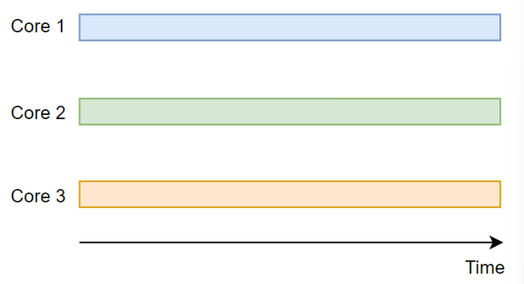
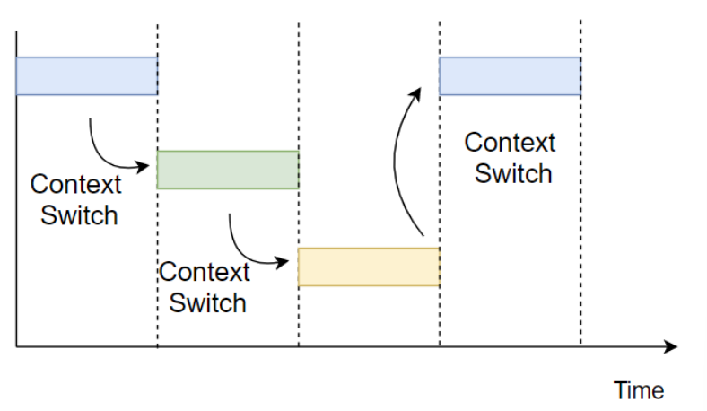

# Concurrency , 동시성
* 동시에 실행되는 것처럼 보이는 것
* 논리적인 개념
* 싱글 코어, 멀티 코어에서 가능

# Parallelism , 병렬성
* 실제로 동시에 실행되는 것
* 물리적인 개념
* 멀티 코어에서만 가능

- - -
# 병행성
* 여러 코어에서 여러 작업을 동시에 수행하는 것
* 코어가 하나밖에 없다면 병렬적으로 프로그램을 실행할 수 없다
* CPU가 Single-Core에서 Multi-Core로 넘어간 이유는 성능의 한계 때문이다
  * 여러 코어에서 여러 작업을 수행하며 성능을 올리려 한 것

* 위와 같은 경우 효율이 세 배까지 올라간다
* 하지만 `Race Condition` 혹은 `동기화 문제`가 발생할 수 있다

# 동시성
* 빠르게 전환하여 여러 작업을 수행하여 동시에 여러작업이 수행되는 것처럼 보이는 것
* 한 개의 코어에서도 여러 작업을 `Concurrent`하게 실행할 수 있다
* 작업 간에는 `Context Switch`가 일어난다

* 스케줄링 정책에 의해 실행
* 서로 복잡하게 엉켜있다
* 동기화 문제가 발생할 수 있다

### 동시화 문제는 Concurrent 한 Task 사이에서 발생한다
* 여러 작업이 동시에 공유된 자원에 접근하려 할 때 발생
* 멀티 코어와 싱클 코어에서 발생할 수 있다