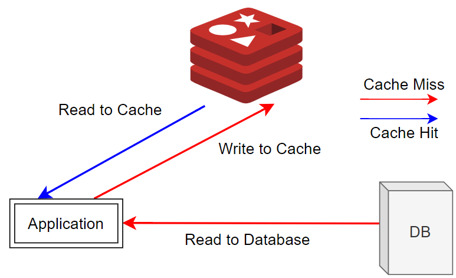

# 캐시?

> 자주 사용하는 데이터나 값을 미리 복사해 놓는 임시 저장소

속도 향상을 위해 사용하며, 다음과 같은 경우에 캐시를 사용한다

* 원본 데이터에 빠르게 접근 가능할 때
* 같은 데이터에 반복적으로 접근할 때
* 변하지 않은 데이터를 주로 사용할 떄

> Redis는 단순한 구조와 in-Memory 저장소로 인한 빠른 성능 때문에 캐시에 주로 쓰인다

 

# 캐싱 전량, Caching Strategies

> 캐시를 사용할 때 어떻게배치하는지는 시스템에 큰 영향을 끼친다.

## Look-Aside

> 데이터를 찾을 때 우선 캐시에서 데이터를 찾고 데이터가 있다면 캐시에서 데이터를 가져오는 전략

* 만약 캐시에 데이터가 없어 **Cache Miss**가 발생한다면 앱은 DB에서 데이터를 가져온 뒤에 캐시에 넣어주는 작업을 한다
* **Lazy Loading** : 캐시에 찾는 데이터가 없을 때 DB에서 직접 조회해서 입력되기 때문에 이렇게 불린다
* 이 구조는 캐시가 다운되더라도 DB에서 데이터를 가져올 수 있다
* 만약 Redis가 다운되거나 DB에만 새로운 데이터가 있다면 많은 Cache Miss로 인해 많은 프로세스가 DB에 접근하기 때문에 DB에 많은 부하가 생길 수 있다
* 이런 경우 DB에서 캐시로 데이터를 미리 넣어주는 작업을 하기도 하는데 이를 Cache Warming이라고 한다

  

 

## Read Through

> 캐시에서만 데이터를 읽어오는 전략

  

1. Cache Miss 발생
2. 캐시 : DB에서 데이터 검색
3. 캐시 자체에 업데이트 한다
4. 앱에 데이터를 보내준다

 

## Write Through

> 데이터를 저장할 때 먼저 캐시에 저장한 다음 DB에 저장하는 방식

  

* 캐시는 항상 최신 정보를 가지고 있지만 저장할 때마다 두 단계를 거쳐야 하기 때문에 상대적으로 느리다
* 저장하는 데이터가 재사용되지 않을 수도 있다
* 이때 무조건 캐시에 넣어버리면 리소스에 낭비가 생길 수 있다
* 이를 방지하기 위해 Expire Time을 설정하기도 한다

> ### Expire Time
>> 데이터가 보관되는 시간
> * 시간 초과시 데이터는 자동 삭제된다

 

## Write Back = Write Behind

> 캐시에 데이터를 저장했다가 특정 시점마다 마다 DB에 저장하는 방식

  

* 캐시에 데이터를 모았다가 한 번에 DB에 저장한다
* 이를 통해 DB 쓰기 비용을 정략할 수 있따
* 하지만 데이터를 옮기기 전에 캐시 장애가 발생하면 데이터 유실이 발생할 수 있다

 

## Write Around

> 모든 데이터는 DB에 저장되고 읽은 데이터만 캐시에 저장되는 방식

  

* Cache Miss가 발생하는 경우에만 캐시에 데이터를 저장하기 때문에 캐시와 DB 내의 데이터가 다를 수 있다
* 주로 Look Aside, Read Through 와 결합해서 사용된다

> ### Write Around + Look Aside
> 

> ### Write Around + Read Througn
> 
