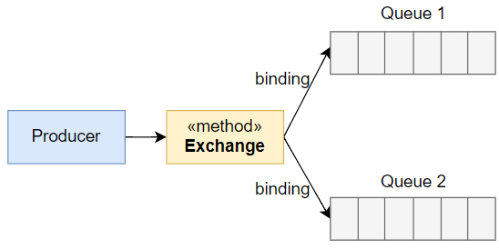
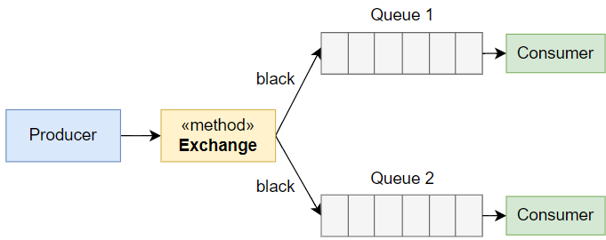
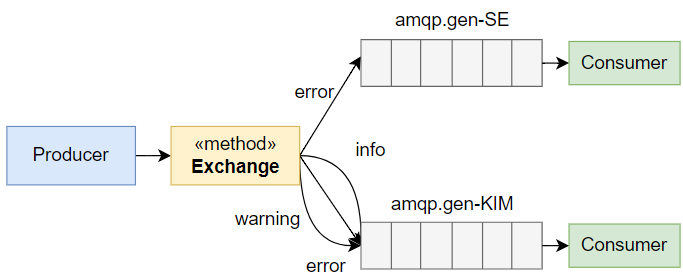
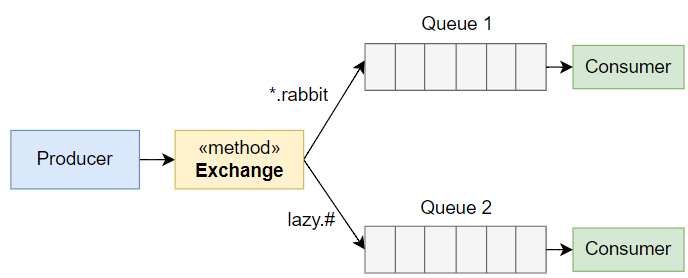
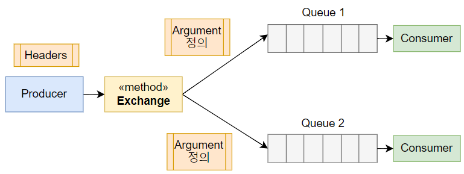

# RabbitMQ

> 서버 간 메시지를 전달해주는 오픈 소스 메세지 브로커

* RabbitMQ는 AMQP 을 구현한 **메시지 브로커**이다
    * `AMQP` : Advanced Message Queuing Protocol
* 이는 `Client Application`과 `Middle Broker`와의 메시지를 주고 받기 위한 프로토콜이다

> RabbitMQ 설명 이미지
> 

<br>

MSA 구조의 서버를 사용하다 보면, 서버와 서버끼리 메시지를 주고 받아야 할 때가 있는데, 이때 RabbitMQ를 사용한다
> 
> `Server1`이 `Server2`에게 메시지를 보낼 때 RabbitMQ를 통해 메시지를 전송한다
> * Producer : Server1
> * Consumer : Server2
> * 반대로 보낼 때는 이가 역전된다

# Exchange

> **Producer에게 받은 Message를 Queue에게 전달한다**

#### 4가지 타입

> `Producer`에게 전달 받은 메시지를 어떤 `Queue`에게 발송할 지 **라우팅**을 결정하는 것

1. Fanout
2. Direct
3. Topic
4. Headers

## Binding

> **Exchange 와 Queue 의 관계를 의미한다**

* `Binding`이 되어있어야 `Exchange`가 `Queue`에게 메시지를 전달할 수 있다
* `Exchange`규칙으로 어떻게 라우팅이 될지 결정되었으면, `Binding`은 결정된 메시지를 어떤 `Queue`에 전달할지 **라우팅 규칙을 결정**하는 것이다

> Exchange 는 라우팅을 결정하고 Binding 은 라우팅할 수 있는 규칙을 지정하는 것.
> 그래서 특정 조건에 맞는 메시지를 큐에 전송하도록 해준다

## Queue

> **Exchange 는 Producer 로부터 전달 받은 메시지를 Binding 되는 Queue 들에게 동일하게 전달한다**

* `Queue`는 전달 받은 메시지들을 `Consumer`에게 전달한다
    * 공평하게 전달하기 위해 **Round-Robin 스케줄**로 메시지를 전달한다
* `Queue`는 `Consumer`들에게 전달되기 전에 메모리나 디스크에 저장해 놓는다

<br>

# Exchange 의 4가지 타입

## Fanout

> Exchange 와 Binding 된 모든 Queue 에게 동일한 메시지를 보낸다



* 전체 메시지와 비슷하다


## Direct

> **Routing Key를 활용하여 라우팅한다**




* Exchange 에서 보낸 메시지를 Routing Key 를 통해 Queue 와 직접 Binding 할 수 있다
* RabbitMQ 에서 사용되는 디폴트 Exchange 는 Direct 이다
* RabbitMQ 에서 생성되는 Queue 가 자동으로 Binding 되고, 이때는 각 Queue 의 이름이 Routing Key 로 지정된다
* 하나의 Queue 에 여러 개의 Routing Key 를 지정할 수 있다
* 여러 Queue 에 동일한 Routing Key 지정 가능

> 메시지의 Routing Key 를 기반으로 Queue 와 1 : N 을 할 수 있다

## Topic

> **Routing Key 패턴이 일치하는 Queue 에게 메시지를 전달한다**



* Direct 는 Routing Key 가 완전히 일치해야 메시지를 전달할 수 있는데
* Topic 은 패턴을 정해서 Binding 규칙을 정의하기 때문에 Direct 방식 보다는 좀 더 유연하게 정의해서 메시지를 보낼 수 있다
    * Topic 은 패턴만 일치하면 Binding 이 된다

#### 규칙

* `*` : 단어 1개를 대체
* `#` : 0개 이상의 단어를 대체(없거나 하나 이상의 단어를 의미)

<br>

* 만약 어떤 Queue 에 Routing Key 를 두 개 지정했을 때
* Routing Key 가 Topic 패턴에 모두 일치하게 되었다 가정한다
* 그러면 메시지 전달이 2번 되는 것이 아니라 Queue 에 한 번만 전달된다

> 하나의 Queue 에 N 개의 Routing Key가 있고, 패턴도 모두 일치한다고 하더라도
> 메시지는 한 번만 전달된다

## Header

> Key-Value 로 정의된 헤더에 의해 메시지를 Queue 에 전달하는 방법



> 헤더 형식

```json
{
  "key1": "rabbit",
  "key2": "lazy"
}
```

> Argument 정의

```json
{
  "x-match": "any",
  "key1": "red",
  "key2": "apple"
}
```

* 메시지를 전달하는 Producer 쪽에서 정의하는 Header 의 Key-Value 와 메시지를 받는 Consumer 쪽에서 정의된 Argument 의 Key-Value가 일치하면 Binding 된다
* Producer 에서 정의하는 Header 는 메시지와 함께 전송된다
* Consumer 쪽에서는 Exchange 와 Queue 가 Binding 되는 시점에 Argument 를 정의한다

### x-match

> Header 에는 x-match 라는 Key 가 있다. 그리고 옵션으로는 any 와 all 이 있다

#### x-match : all

* Header 의 Key-Value 와 Argument 의 Key-Value 가 정확히 일치해야 Binding 된다

#### x-match : any

* Producer 가 전송하는 Header 의 Key-Value 값과 Argument 의 Key-Value 값 중 하나라도 일치하는 것이 있으면 Binding 된다
