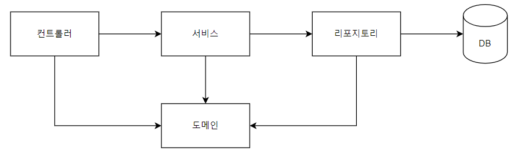

# 웹 애플리케이션 동작 구조

## 컨트롤러

* 웹 MVC 의 컨트롤러이다

## 서비스

* 컨트롤러의 요청을 받아 비즈니스 로직을 처리한다
* 이로 인하여 데이터를 다루게 된다

## 리포지토리

* 데이터베이스에 접근할 수 있는 객체이다

## 도메인

* 비즈니스 도메인 객체라고도 한다
* DB에 저장하고 관리되는 데이터를 말한다
    * 사람 : 이름, 나이, 키 등등