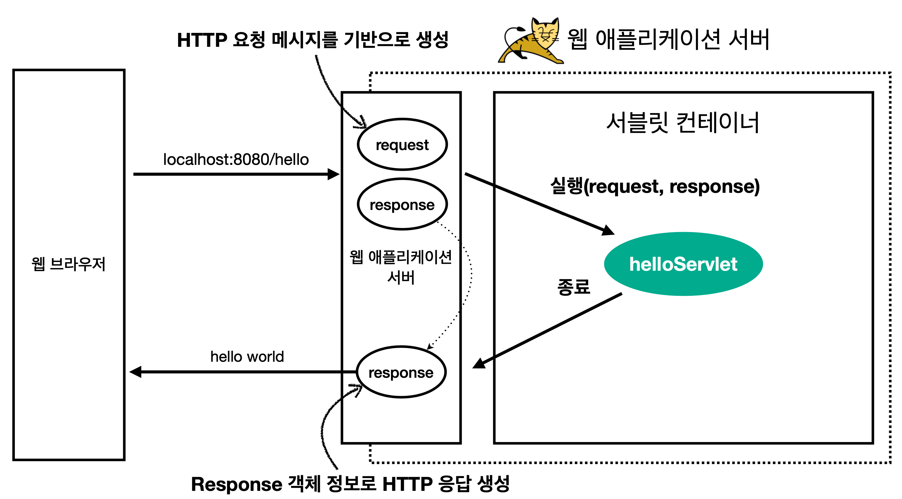

# 서블릿

```java

@WebServlet(name = "sampleServlet", urlPatterns = "/sample")
public class SampleServlet extends HttpServlet {
    @Override
    protected void service(HttpServletRequest request, HttpServletResponse response) {
        //애플리케이션 로직
    }
}
```

URL이 호출되면 해당 코드가 실행된다. 이 코드에 애플리케이션 로직만 작성하면 된다.

### HttpServletRequest

HTTP 요청 정보를 편리하게 사용하도록 한다

### HttpServletResponse

HTTP 응답 정보를 편리하게 제공한다

<br>
서블릿 덕분에 개발자는 HTTP를 편리하게 사용할 수 있다



### 1. URL 요청

WAS가 요청메시지를 기반으로 request, response 객체를 생성한다

* 개발자는 request 객체에서 HTTP 요청 정보를 편리하게 꺼내서 사용한다

### 2. Servlet Container

두 객체를 넘겨 받은 서블릿 컨테이너는 개발자가 만든 sampleServelt을 실행한다

### 3. response 객체 전달

리턴을 하면 response 객체에 응답 메시지를 만들어 브라우저에 전달한다

* 개발자는 response 객체에 HTTP 응답 정보를 입력한다
* WAS는 response 객체에 담겨있는 내용으로 HTTP 응답 정보를 생성한다

## 서블릿 컨테이너


* 톰갯처럼 서블릿을 지원하는 WAS
* 서블릿 객체 생성, 초기화, 호출, 종료 - 생명주기 관리
* 싱글톤으로 관리 - 요청할 때마다 객체 생성은 비효율적 and Request, Response는 요청마다 데이터가 다르다
* 최초 로딩 시점에 서블릿 객체를 미리 만들어두고 재활용 : 애플리케이션 안에는 로직만 작성하면 되므로 항상 재사용 가능
* 모든 요청은 동일한 서블릿 객체에 접근한다
* JSP도 서블릿 변환되어 사용
* 동시 요청을 위한 멀티 스레드 처리 지원

# 멀티 스레드

### 스레드

브라우저가 요청을 보냈을 때 서블릿 객체를 호출하는 것

* 애플리케이션 코드를 하나하나 순차적으로 실행
* 자바 메인 메소드를 실행하면 main 스레드가 실행
* 스레드가 없다면 자바 애플리케이션은 실행 불가능하다
* 스레드는 한 번에 하나의 코드라인만 수행
* 동시 처리가 필요하면 스레드 추가 생성

### 다중 요청 - 다중 스레드

> 단일 스레드는 여러 요청이 들어왔을 때 처리하기 어렵다.
> 이를 해결하기 위해 다중 스레드를 사용한다

#### 요청마다 스레드 생성

* 동시 요청 처리 가능
* 리소스가 허용하는 한 처리 가능
* 하나의 스레드가 지연되어도 다른 스레드는 정상 동작
* 스레드 생성 비용이 비쌈
* 스레드는 컨텍스트 스위칭 비용이 발생
* 스레드 생성에 제한이 없다 - 서버 과부화 가능

### 스레드 풀

> 요청마다 스레드를 생성하는 단점을 보완해 풀 안에 스레드를 미리 만들어 놓고 사용하는 방법

* hikari-pool
* OS의 Kernal Pool

#### 특징

* 스레드 풀이 스레드 보관 후 관리
* 생성 가능한 최대치 관리
* 스레드 풀에서 스레드를 꺼내서 사용 - 사용 후 반납
* 스레드가 모두 사용 중이면 : 거절 or 대기

#### 장점

* 빠르다
* 너무 많은 요청이 들어와도 안전하게 처릭 ㅏ능

# HTML, HTTP API, CSR, SSR

### 정적 리소스

보통 HTML, CSS, JS, 이미지, 영상 등을 제공한다

* 브라우저에서 리소스를 요청하면 서버에서 보내준다

## HTTP API

> HTML을 단순히 전달하는 게 아니라 데이터를 전달한다

* JSON 형식으로 많이 전달한다
* UI 클라이언트와의 접점이 된다
* 서버 to 서버

## SSR - 서버 사이트 렌더링

* HTML 최종 결과를 서버에서 만들어 웹 브라우저에 전달한다
* 주로 정적인 화면에 사용
* JSP, Thymleaf
* 요청이 들어오면 서버가 최종적으로 HTML을 랜더링해서 전달한다
* 과정은 서버에서 끝내고 클라이언트는 받은 것을 보여주기만 한다

```html

<table>
    <thead>
    <tr>
        <th>모델명</th>
        <th>식별번호</th>
    </tr>
    </thead>
    <tbody>
    <tr th:each="board : ${boardList}">
        <td><span th:text="*{board.model}"></span></td>
        <td><span th:text="*{board.number}"></span></td>
    </tr>
    </tbody>
</table>
```

## CSR - 클라이언트 사이드 렌더링

* 자바 스크립트를 사용해 HTML 결과를 브라우저에서 동적으로 생성해서 사용
* 주로 동적인 화면에 사용
* 웹 환경을 마치 앱처럼 필요한 부분만 변경 가능
* React, Vue

<br>

SSP을 사용하더라도 자바 스크립트를 사용해 화면 일부를 동적으로 변경할 수도 있다.
* React, Vue로 CSR + SSR을 동시에 지원하는 프레임워크도 있다
