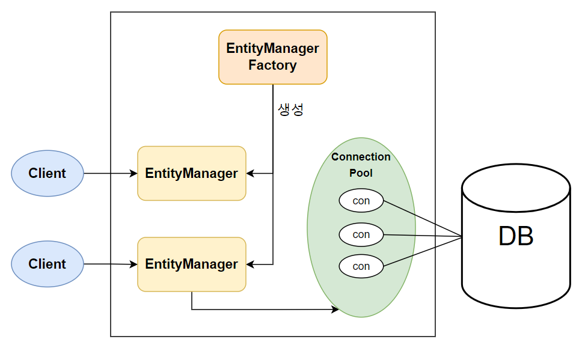

# Entity

> DB의 테이블과 매칭되는 하나의 클래스

```java

@Entity
@Getter
@Setter
@Table(name = "Member")
public class Member {
    @Id
    @GenerateValue(strategy = GenerationType.IDENTIFY)
    private Long id;

    @Column(name = "name")
    private String name;
}
```

<br>
<br>

# EntityManager

> Entity를 관리하는 역할을 수행하는 클래스

* EntityManager 내부의 **Persistence Context**라는 것을 두어 Entity를 관리한다

## 영속성 컨텍스트, Persistence Context

* **영속성** : 비휘발성
* **컨텍스트** : 하나의 환경 또는 공간

> 영속성 컨텍스트는 엔티티를 영구히 저장하는 환경이다.

Persistence Context를 관리하는 모든 **EntityManager**가 초기화 및 종료되지 않는 한 엔티티를 영구히 저장하는 환경

## Entity 관리 방법

```java

@Service
@RequiredArgsConstructor
public class MemberService {

    private final EntityManageFactory entityManagerFactory = Persistence.createEntityFactory("persistence");

    public void register(String name) {
        Member member = new Member(name);

        EntityManager entityManager = entityManagerFactory.getEntityManager();
        EntityTransaction transaction = entityManager.getTransaction();

        try {
            transaction.begin();

            entityManager.persist(member);

            transaction.commit();
        } catch (Exception e) {
            transaction.rollback();
        } finally {
            entityManager.close();
        }
    }
}
```

## 쓰기 지연 SQL 저장소

> Persistence Context 안에 존재하는 공간

```java

@Service
public class MemberService {
    private final EntityManageService entityManageService;

    public void register(String name1, String name2) {
        Member member1 = new Member(name1);
        Member member2 = new Member(name2);

        EntityManager entityManager = entityManageService.getEntityManager();
        EntityTransaction transaction = entityManager.getTransaction();

        try {
            transaction.begin();

            entityManager.persist(member1);
            entityManager.persist(member2);

            transaction.commit();
        } catch (Exception e) {
            transaction.rollback();
        } finally {
            entityManager.close();
        }
    }
}
```

### 동작 순서

1. Commit 전에 모든 쿼리 문이 SQL 저장소에 저장된다
2. Transaction Commit이 되는 순간 모든 쿼리가 한 번에 날린다
3. 만약 트랜잭션 내부에서 오류가 나서 롤백을 해야 한다면 애초에 날리지 않을 쿼리를 날리지 않는다

```
성능 문제 때문에 이런 동작을 한다
```

<br>
<br>

# EntityManagerFactory

> EntityManager를 만드는 공장

* `BeanFactory`와 같은 작명법
* 생성 비용이 무겁다

<br>



* EntityManagerFactory : 여러 스레드가 동시에 접근해도 안전하기 때문에 다른 스레드 간 공유해도 문제가 없다.
* EntityManager : 여러 스레드가 동시에 접근하면 동시성 문제가 발생하기 때문에 스레드간 공유를 하면 안 된다

<br>

EntityManager는 DB 연결이 필요한 시점까지 커넥션을 얻지 않는다.

```
보통 트랜잭션을 시작할 때 커넥션을 얻는다
```

<br>

## 생성 방법

```java
class EntityManagerFactorySample {

    //EntityManagerFactory 생성
    EntityManagerFactory emf =
            Persistence.createEntityFactory("persistence");

    //EntityManager 생성
    EntityManager em = emf.createEntityManager();
}
```

EntityManagerFactory는 META-INF/persistence.xml에 있는 정보를 바탕으로 생성한다

```xml
<?xml version="1.0" encoding="UTF-8"?>
<persistence version="2.2"
             xmlns="http://xmlns.jcp.org/xml/ns/persistence" xmlns:xsi="http://www.w3.org/2001/XMLSchema-instance"
             xsi:schemaLocation="http://xmlns.jcp.org/xml/ns/persistence http://xmlns.jcp.org/xml/ns/persistence/persistence_2_2.xsd">
    <!--  EntityManagerFactory 생성 시 사용되는 persistence name -->
    <persistence-unit name="persistence">
        <properties>
            <!-- 필수 속성 -->
            <property name="javax.persistence.jdbc.driver" value="com.mysql.cj.jdbc.Driver"/>
            <property name="javax.persistence.jdbc.user" value="root"/>
            <property name="javax.persistence.jdbc.password" value="kk020206**"/>
            <property name="javax.persistence.jdbc.url"
                      value="jdbc:mysql://localhost:3306/todo?characterEncoding=UTF-8&amp;serverTimezone=UTC"/>

            <!-- 하이버네이트 사용 시 다른 DB에서 MySQL 문법을 사용 가능하도록 변경.-->
            <property name="hibernate.dialect" value="org.hibernate.dialect.MySQL8Dialect"/>
            <!-- 콘솔에 SQL 출력 여부 -->
            <property name="hibernate.show_sql" value="true"/>
            <!-- 가독성 높여주는 formatting 여부 -->
            <property name="hibernate.format_sql" value="true"/>
            <!-- Comment 확인 여부 -->
            <property name="hibernate.use_sql_comments" value="true"/>
        </properties>
    </persistence-unit>
</persistence>
```

여기서 <persistence-unit name="persistence">의 속성을 persistence로 해놨기 때문에 만들 때 String 값을 persistence로 넣어주면 된다.

<br>

# Criteria

> JPQL 작성을 도와주는 빌더 클래스.

* 문자열로 작성하면 런타임에 문법 오류를 알 수 있다
* 하지만 Criteria는 자바 코드 기반이기 때문에 안전하게 JPQL을 작성할 수 있다

```java
@Entity
@Data
class Member {
    private String name;
    private Integer age;
}
```

```java
public class CriteriaSample {
    public void sample() {
        //Criteria query builder
        CriteriaBuilder cb = em.getCriteriaBuilder();

        //Criteria 생성, 반환 타입 지정
        CriteriaQuery<Member> cq = cb.createQuery(Member.class);

        Root<Member> m = cq.from(Member.class); //From clauss
        cq.select(m); //Select clauss

        TypedQuery<Member> query = em.createQuery(cq);
        List<Member> members = query.getResultList();
    }
}
```

<br>

## WHERE 절과 ORDER BY 절 작성하기

```java
public class CriteriaSample {
    public void sample() {
        //Criteria query builder
        CriteriaBuilder cb = em.getCriteriaBuilder();

        //Criteria 생성, 반환 타입 지정
        CriteriaQuery<Member> cq = cb.createQuery(Member.class);

        Root<Member> m = cq.from(Member.class); //From class

        //Where clause, m.name = 'Name#2'
        Predicate usernameEqual = cb.equal(m.get("name"), "Name#2");

        //Order by clause, order by id desc(내림차순)
        Order idDesc = cb.desc(m.get("id"));

        //Select clause
        cq.select(m)
                .where(usernameEqual)
                .orderBy(idDesc);

        List<Member> members = em.createQuery(cq)
                .getResultList();
    }
}
```

이런식으로 코드를 작성하면 이것을 SQL 문으로 작성해서 쿼리를 날린다

```hiveql
Hibernate: 
    /* select
        generatedAlias0 
    from
        Member as generatedAlias0 */
select member0_.member_id       as member_i1_6_,
       member0_.insert_datetime as insert_d2_6_,
       member0_.update_datetime as update_d3_6_,
       member0_.city            as city4_6_,
       member0_.street          as street5_6_,
       member0_.zipcode         as zipcode6_6_,
       member0_.name            as name7_6_
from member member0_ member's name: Name#1
member's name: Name#2
```

# Not an Entity

> Entity가 등록되지 않아서 발생하는 예외

```java

@Service
public class Service {

    @Transactional
    public DiaryResponse get(Long id) {
        EntityManager entityManager = entityManagerFactory.createEntityManager();
        CriteriaBuilder criteriaBuilder = entityManager.getCriteriaBuilder();

        CriteriaQuery<Diary> criteriaQuery = criteriaBuilder.createQuery(Diary.class);
        Root<Diary> root = criteriaQuery.from(Diary.class);     //Error 발생

        Predicate idEquals = criteriaBuilder.equal(root.get("id"), id);

        criteriaQuery.select(root).where(idEquals);

        Diary diary = entityManager.createQuery(criteriaQuery).getSingleResult();

        return DiaryResponse.from(diary);
    }
}
```

### 해결 방법

> Entity를 등록해준다

```java
@Entity
public class Diary {
    @Id
    @Colume
    private Long id;

    @Column
    private String title;
}
```

이 방법으로 안 될 시 아래 방법을 이용한다

```xml
<?xml version="1.0" encoding="UTF-8"?>
<persistence version="2.2"
             xmlns="http://xmlns.jcp.org/xml/ns/persistence" xmlns:xsi="http://www.w3.org/2001/XMLSchema-instance"
             xsi:schemaLocation="http://xmlns.jcp.org/xml/ns/persistence http://xmlns.jcp.org/xml/ns/persistence/persistence_2_2.xsd">
    <!--  EntityManagerFactory 생성 시 사용되는 persistence name -->
    <persistence-unit name="persistence">
        <class>com.example.demo.entity.Diary</class>
        <properties>
            <!-- 필수 속성 -->
            <property name="javax.persistence.jdbc.driver" value="com.mysql.cj.jdbc.Driver"/>
            <property name="javax.persistence.jdbc.user" value="root"/>
            <property name="javax.persistence.jdbc.password" value="kk020206**"/>
            <property name="javax.persistence.jdbc.url"
                      value="jdbc:mysql://localhost:3306/todo?characterEncoding=UTF-8&amp;serverTimezone=UTC"/>

            <!-- 하이버네이트 사용 시 다른 DB에서 MySQL 문법을 사용 가능하도록 변경.-->
            <property name="hibernate.dialect" value="org.hibernate.dialect.MySQL8Dialect"/>
            <!-- 콘솔에 SQL 출력 여부 -->
            <property name="hibernate.show_sql" value="true"/>
            <!-- 가독성 높여주는 formatting 여부 -->
            <property name="hibernate.format_sql" value="true"/>
            <!-- Comment 확인 여부 -->
            <property name="hibernate.use_sql_comments" value="true"/>
        </properties>
    </persistence-unit>
</persistence>
```

이렇게 XML에서 수동적으로 클래스를 등록해줄 수도 있다.

# criteria by reflection for persistent property

> Criteria를 사용할 때 변수형이 맞지 않아서 발생하는 예외

```java

@Entity
@Table(name = "members")
public class Member {
    @Id
    @Column
    private Long id;

    @Column
    private String name;
}
```

```java
public interface MemberRepository extends JpaRepository<Member, Long> {
}
```

JPA에서는 위와 같은 방식으로 테이블을 만든다. 이때 실제 DB에 저장되는 값과 코드 상의 변수형이 달라서 일어나는 예외이다.

## MySQL의 자료형
> 정수형
* bit
* bool
* tinyint
* smallint
* mediumint
* int
* bigint

<br>

> 문자형
* char
* varchar
* tinyblob
* tinytext
* blob
* text
* mediumblob
* mediumtext
* longblob
* longtext
* enum
* set

```
Java의 자료형과는 확연히 다르다
```

# JpaSpecificationExecutor
```java
@Repository
public interface DiaryRepository extends JpaRepository<Diary, Long>, JpaSpecificationExecutor<Diary> {
}
```
이것을 적용하니까 Not Entity Found 에러가 해결되었다.